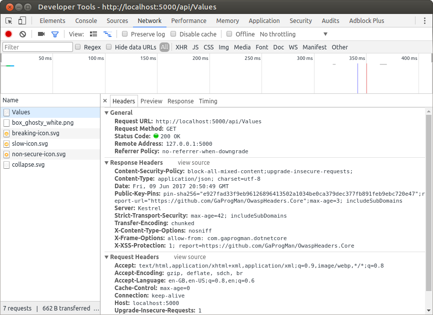

# OwaspHeaders.Core
A .NET Core middleware for injecting the Owasp recommended HTTP Headers for increased security.

## Licence Used

See the contents of the LICENSE file for details

## Description
A collection of ASP.NET Core middleware classes designed to increase web application security by adopting the recommended [OWASP](https://www.owasp.org/index.php/Main_Page) settings.

### Secure Headers
The `SecureHeadersMiddleware` is used to inject the HTTP headers recommended by the [OWASP Secure Headers](https://www.owasp.org/index.php/OWASP_Secure_Headers_Project) project into all responses generated by the ASP.NET Core pipeline.

#### Usage
In the constructor for the `Startup` class, add a reference to a `secureHeaderSettings.json`

    public Startup(IHostingEnvironment env)
    {
        var builder = new ConfigurationBuilder()
        .SetBasePath(env.ContentRootPath)
        .AddJsonFile("appsettings.json", optional: true, reloadOnChange: true)
        .AddJsonFile($"appsettings.{env.EnvironmentName}.json", optional: true)
        .AddJsonFile("secureHeaderSettings.json", optional:true, reloadOnChange: true)
        .AddEnvironmentVariables();
        Configuration = builder.Build();
    }
The contents of the `secureHeaderSettings.json` file take the following format:

    {
        "SecureHeadersMiddlewareConfiguration": {
            "UseHsts": "true",
            "HstsConfiguration": {
                "MaxAge": 42,
                "IncludeSubDomains": "true"
            },
            "UseHpkp": "true",
            "HPKPConfiguration" :{
                "PinSha256" : [
                    "e927fad33f9eb96126896413502a1034be0ca379dec377fb891feb9ebc720e47"
                    ],
                "MaxAge": 3,
                "IncludeSubDomains": "true",
                "ReportUri": "https://github.com/GaProgMan/OwaspHeaders.Core"
            },
            "UseXFrameOptions": "true",
            "XFrameOptionsConfiguration": {
                "OptionValue": "allowfrom",
                "AllowFromDomain": "com.gaprogman.dotnetcore"
            },
            "UseXssProtection": "true",
            "XssConfiguration": {
                "XssSetting": "oneReport",
                "ReportUri": "https://github.com/GaProgMan/OwaspHeaders.Core"
            },
            "UseXContentTypeOptions": "true",
            "UseContentSecurityPolicy": "true",
            "ContentSecurityPolicyConfiguration": {
                "BlockAllMixedContent": "true",
                "UpgradeInsecureRequests": "true"
            }
        }
    }
(the above file is provided for illustration purposes)

Load the contents of the `secureHeaderSettings.json` into an instance of the `SecureHeadersMiddlewareConfiguration` in the Startup class'  `ConfigureServices` method.

    public void ConfigureServices(IServiceCollection services)
    {
        // Add framework services
        // Add functionality to inject IOptions<T>
        services.AddOptions();

        // Add our Config object so it can be injected
        services.Configure<SecureHeadersMiddlewareConfiguration>(Configuration.GetSection("SecureHeadersMiddlewareConfiguration"));
    }
Add the `SecureHeadersMiddleware` into the ASP.NET Core pipeline, in the Startup class' `Configure` method.

    public void Configure(IApplicationBuilder app, IHostingEnvironment env,
        IOptions<SecureHeadersMiddlewareConfiguration> secureHeaderSettings)
    {
        // Add SecureHeadersMiddleware to the pipeline
        app.SecureHeadersMiddleware(secureHeaderSettings.Value);
    }
Run the application, request one of the pages that it serves and view the headers for the page.

This can be done in Google Chrome, using the Dev tools and checking the network tab

